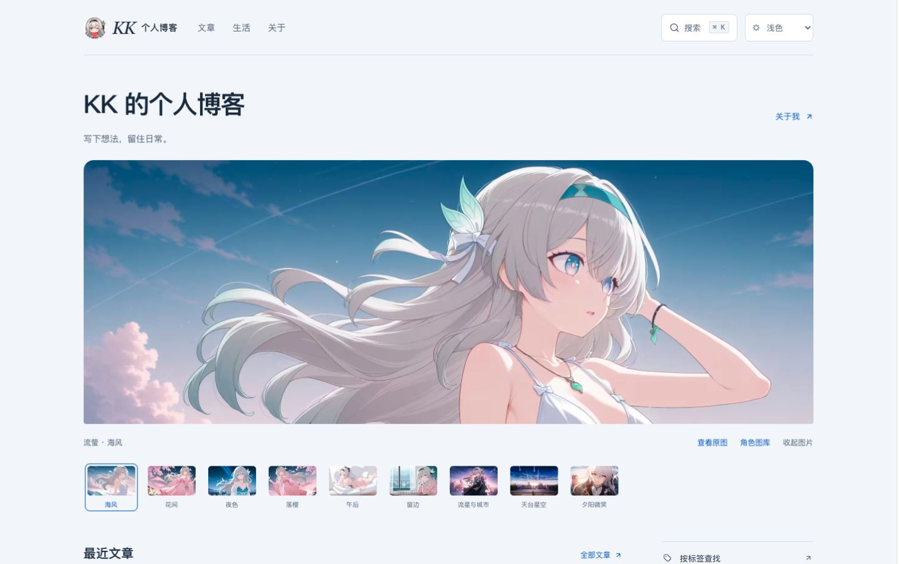
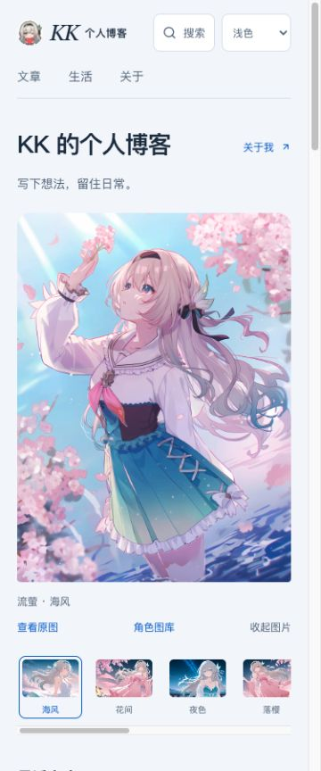
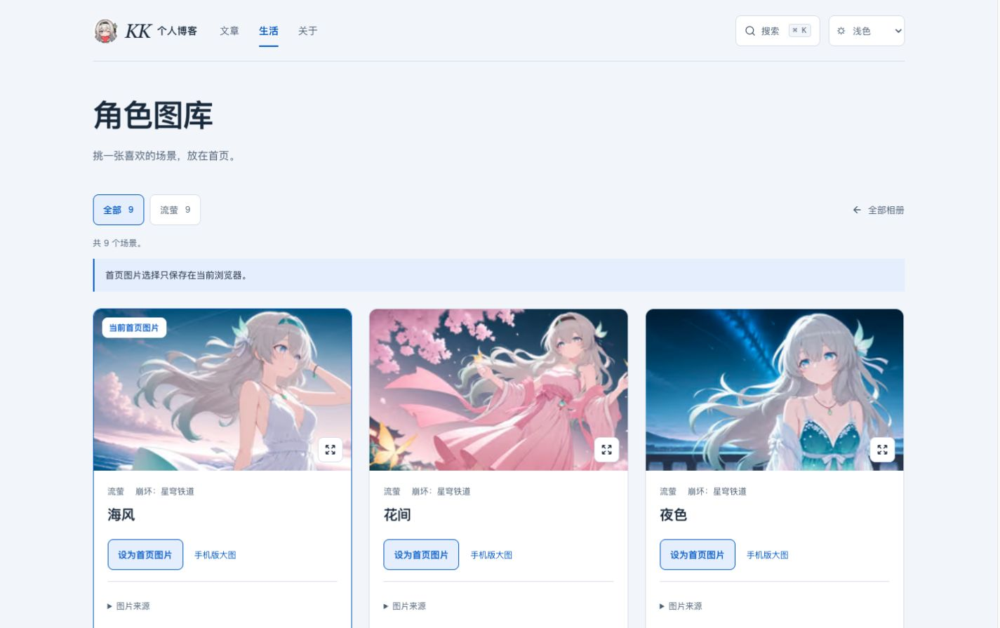

# 个人博客与流萤视觉：最终实现

日期：2026-10-04。根据用户“各种主题随兴趣写，不固定分类”和“清晰克制，有工程感和个人温度”的选择完成。设计、资源恢复、功能修补和页面验收均已落实，上传前检查已完成，当前进行 Git 交付。

## 完整方案与实现

首页由简短个人题签、角色画面和按时间排列的全部文章构成。移除将全站限定为通信协议的宣传文字、固定技术推荐与 LTE 专属首页卡片。专业文章保留自己的标题、分类和正文；分类、标签、专题作为查找入口。

角色图承载个人偏好，正文使用实色、清晰的阅读区。页头使用流萤头像与 KK 字形；雾蓝底色、墨色正文、细分隔线、时间排版和青蓝色强调共同构成视觉。首页不自动轮播图片，读者可以手动选择或收起。

- 首页 9 个真实流萤场景，6 组横竖图配对；选择与收起状态在当前浏览器记忆，独立于明暗主题。
- 角色图库提供角色筛选、大图灯箱、手机版大图、来源说明和“设为首页图片”。目前仅加入真实流萤资源，未来角色通过同一配置扩充。
- 默认首屏加载当前画面；缩略图和图库按需加载。已加入尺寸、裁切焦点、键盘操作、失败回退和无 JavaScript 提示。
- 文章、归档、标签、分类、通用专题、生活、相册、音乐、片单、留言、订阅和搜索使用统一布局。远端新增的人体肌群图谱已保留，并在生活页提供入口。
- 保留 11 篇实际文章、其中 8 篇的密码保护。文章正文和既有密码配置未改动，搜索、RSS 和动态 API 不包含受保护正文。

## 原图恢复与新增图片

先实际检查了线上网站的电脑和手机界面。旧站的流萤背景仍然可显示，新版缺少的是加载入口。原始文件在 Git 历史中完整存在。

从 `ba8086e` 的父提交 `18614b1` 原样恢复 6 张电脑壁纸、6 张手机壁纸和 1 张头像，共 13 个文件、2,102,549 字节，现保存在 `public/images/characters/firefly/`。保留画面中的原署名，原收藏图的具体作者及使用条件尚未追溯。

另加入 3 张实际检查过的 PV 画面：“流星与城市”“天台星空”“夕阳微笑”。来源是 HoYoLAB 用户 kaoskey 的[流萤壁纸图集](https://www.hoyolab.com/article/28855308)，图集中将这些画面标为 PV 素材；该社区帖子不是官方账号发布。图库逐张保留来源链接和说明，未宣称获得再分发许可。

旧的“可爱流萤”相册保留。悬浮模型和动画不属于本次图片恢复，不加入阅读区域。

## 添加其它角色

1. 将实际选定图片放到 `public/images/characters/<角色>/`，制作轻量缩略图。
2. 在 `src/config/characterConfig.ts` 的 `characterScenes` 增加唯一 `id`、场景名、角色、作品、横图、竖图、缩略图、两端裁切焦点与来源说明。只有横图时可以暂时使用同一资源作为 `mobile`，但需实际检查手机裁切。
3. 首页和图库共享配置，筛选入口会随真实角色自动生成。不要添加没有资源的占位角色。
4. 检查实际图片、出处与使用条件后，运行项目检查并验收两端画面。

## 已补齐的功能缺口

- 草稿在开发预览可见，生产构建排除；标签、分类和关联文章使用相同规则。
- 动态内容递归发现子目录；仅含空目录时正确显示空状态，页面、摘要和 API 一致。
- Waline 访客开关映射到实际 `pageview` 配置，继续按需初始化。
- 搜索结果保留关键词高亮，安全重建文字与 `mark`，避免直接插入结果 HTML 的属性或主动内容。
- 密码表单在脚本失效时无法默认 GET 提交；输入不含 `name`，脚本装好处理器后才启用按钮。

## 验收结果

- `pnpm check`：128 个文件，0 错误、0 警告、0 提示。
- `pnpm type-check`：通过。
- `pnpm build`：通过；生成和核验 49 个 HTML 页面、11 篇索引文章、8 篇加密文章，无内部链接或静态资源断链。
- 12 个关键页面 × 手机/桌面 × 浅色/深色，共 48 个状态，无页面横向溢出或可见图片缺失。记录见 [browser-verification.json](browser-verification.json)。
- 实测选图重载记忆、收起/恢复、图库设为首页、手机竖图、大图键盘开启与 Esc 关闭、搜索高亮、错误密码提示、选图资源失效回退。
- 验证首页两页覆盖全部文章，专题（一）至（六）顺序正确，旧 `?topic=` 链接转向完整归档筛选。新增生活工具入口在两端没有溢出。

### 实际页面截图

## Git 比较与交付

开始交付前已获取远端，发现 `origin/master` 比原本地 HEAD 新 4 个提交。以最新远端 `cf10523` 为基础建立 `codex/personal-blog`，保留远端的人体肌群页面，再承接本地已完成的设计迁移和本轮修补。

构建工作流覆盖 `master` 和 `codex/**`，部署工作流继续只在 `master` 推送时运行。提交到设计分支可检查完整变更，合并 `master` 后才触发原有线上部署。

## 最终交付计划

工具集没有 `update_plan`，使用本表与根目录 CSV 同步；仅一项 `in_progress`，全部完成后删除 CSV。

| 步骤 | 状态 |
| --- | --- |
| 1. 核对方案原图与远端更新 | completed |
| 2. 恢复角色图并完成首页与图库 | completed |
| 3. 补齐已确认的功能缺口 | completed |
| 4. 诊断构建与浏览器验收 | completed |
| 5. 文档与上传前检查 | completed |
| 6. 提交推送 Git 并核验 | in_progress |
