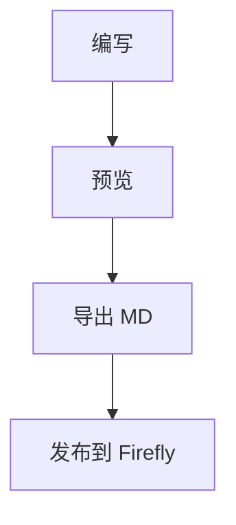
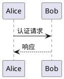

# 欢迎使用 Firefly Markdown

这是一款 **纯前端 · 零依赖 · 离线可用** 的博文生成器，为 [Astro-Firefly](https://github.com/CuteLeaf/Firefly) 主题量身打造。支持完整 FrontMatter、实时预览与一键导出。

> [!TIP]
> 输入 `/` 可以唤出快捷命令菜单，所有语法都能一键插入。

## 一、基础语法

### 文字样式

**加粗**、*斜体*、***加粗斜体***、~~删除线~~、`行内代码`、:spoiler[剧透遮罩，鼠标移上去显示]。

### 列表

无序列表：

- 左侧填写文章信息
- 中间编写正文
- 右侧实时预览

有序列表：

1. 编写 FrontMatter
2. 编写正文
3. 导出 MD

任务清单：

- [x] 完整 FrontMatter
- [x] 实时预览
- [ ] 写一篇真正的文章

### 引用与分割线

> 这是一段引用文字，可以跨越多行书写。

---

## 二、提示块（三种风格）

GitHub 风格：

> [!NOTE]
> GitHub 风格的提示块，支持 note / tip / warning / danger 等类型。

Docusaurus 风格：

:::tip[小技巧]
输入 `/` 唤出命令菜单，选择「提示块」即可插入。
:::

Obsidian 风格：

!!! warning "注意"
    这是 Obsidian 风格的提示块，标题写在引号里。

## 三、代码块

带文件名与行高亮：

```js title="hello.js" {2}
// 代码块自带语法高亮，可写 title="文件名" 与行标记 {2}
const hello = (name) => `Hello, ${name}!`;
console.log(hello('Firefly'));
```

显示行号（showLineNumbers）：

```python showLineNumbers
def fib(n):
    a, b = 0, 1
    for _ in range(n):
        a, b = b, a + b
    return a
```

代码组（多语言切换）：

::: code-group labels=[Shell,PowerShell]
```bash
npm install
```
```powershell
pnpm add
```
:::

## 四、数学公式（KaTeX）

行内公式：质能方程 $E = mc^2$ 与欧拉恒等式 $e^{i\pi} + 1 = 0$。

块级公式：

行内：质能方程 $E = mc^2$，欧拉恒等式 $e^{i\pi} + 1 = 0$，高斯积分 $\int_{-\infty}^{\infty} e^{-x^2}\,dx = \sqrt{\pi}$。

麦克斯韦方程组：
$$
\begin{aligned}
\nabla \cdot \mathbf{E} &= \frac{\rho}{\varepsilon_0} \\
\nabla \cdot \mathbf{B} &= 0 \\
\nabla \times \mathbf{E} &= -\frac{\partial \mathbf{B}}{\partial t} \\
\nabla \times \mathbf{B} &= \mu_0\left(\mathbf{J} + \varepsilon_0\frac{\partial \mathbf{E}}{\partial t}\right)
\end{aligned}
$$

求根公式：
$$ x = \frac{-b \pm \sqrt{b^2 - 4ac}}{2a} $$

矩阵行列式：
$$ \det\begin{pmatrix} a & b \\ c & d \end{pmatrix} = ad - bc $$

分段函数：
$$ f(x) = \begin{cases} x^2 & x \ge 0 \\ -x & x < 0 \end{cases} $$

级数：
$$ \sum_{n=1}^{\infty} \frac{1}{n^2} = \frac{\pi^2}{6} $$

贝叶斯定理：
$$ P(A\mid B) = \frac{P(B\mid A)\,P(A)}{P(B)} $$

傅里叶变换：
$$ \hat{f}(\xi) = \int_{-\infty}^{\infty} f(x)\, e^{-2\pi i x \xi}\, dx $$

集合论：
$$ \mathbb{R} \subset \mathbb{C}, \quad \forall x \in \mathbb{R},\ \exists!\, y \in \mathbb{R} : y^2 = x $$

薛定谔方程：
$$ i\hbar\frac{\partial}{\partial t}\Psi(\mathbf{r},t) = \left[ -\frac{\hbar^2}{2m}\nabla^2 + V(\mathbf{r},t) \right]\Psi(\mathbf{r},t) $$

自然对数底极限：
$$ \lim_{n \to \infty} \left(1 + \frac{1}{n}\right)^n = e $$

## 五、图表

Mermaid 流程图：



PlantUML 图（构建时渲染为静态 SVG）：



## 六、内部链接与文章卡片

行内内部链接：[[firefly|Firefly 主题介绍]]（自动使用目标文章标题）。

独占一段的内部链接会渲染为文章卡片（需目标文章已存在于本地文档库，否则显示占位卡片）：

[[firefly]]

## 七、第三方嵌入

GitHub 仓库卡片：

::github{repo="CuteLeaf/Firefly"}

视频嵌入（B站 / YouTube，直接插入 `<iframe>`）：

<iframe width="100%" height="468" src="https://player.bilibili.com/player.html?bvid=BV1wKuc6hECD&p=1&autoplay=0&high_quality=1&danmaku=0" frameborder="0" allow="accelerometer; autoplay; clipboard-write; encrypted-media; gyroscope; picture-in-picture" allowfullscreen></iframe>

图片画廊（[grid] … [/grid]，最多并排 4 张）：

[grid]


[/grid]

## 八、表格与脚注

| 功能 | 状态 | 说明 |
| :--- | :--: | ---: |
| 离线可用 | ✅ | 双击 HTML 即可 |
| 自动缓存 | ✅ | 刷新不丢失 |
| 三端适配 | ✅ | 桌面 / 平板 / 手机 |


> [!NOTE]
> 在左侧「基础信息」填写好标题、slug、分类等后，点击顶部「导出 MD」即可生成符合 Firefly 主题的 Markdown 文件。
